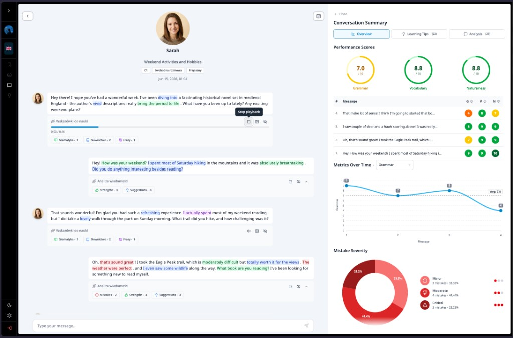
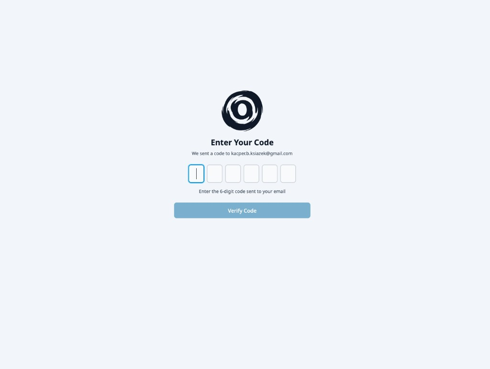
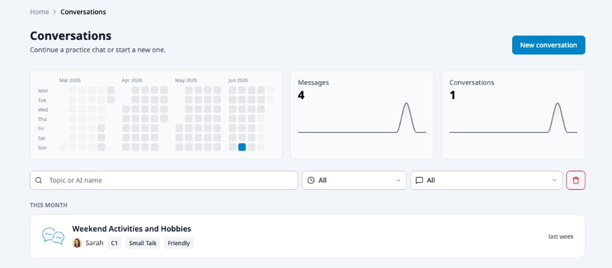
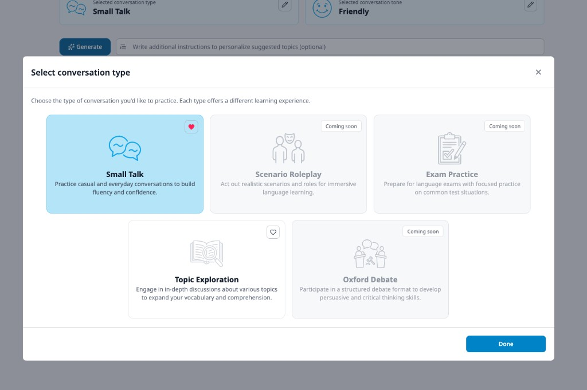

<div align="center">

# Ord

### Practice real conversations with an AI partner — and get instant, structured feedback on every message.

**Ord** is an AI-powered language-learning app. Instead of flashcards and drills, you hold real conversations with an AI interlocutor, then receive per-message analysis, grammar and vocabulary tips, and a full performance breakdown of how you're improving over time.

This repository contains the **frontend** — a SvelteKit 2 + Svelte 5 single-page app. _(The backend API lives in a separate service.)_

<br />

[](https://kit.svelte.dev/)
[](https://svelte.dev/)
[](https://www.typescriptlang.org/)
[](https://tailwindcss.com/)
[](https://tanstack.com/query)
[](https://vitest.dev/)

<br />

<!-- Update the href once your demo is live (and remove this comment). 
[](#)
[](#)
-->
</div>

<p align="center">
  
  <br />
  <em>A live session: chat with your AI partner on the left, real-time feedback &amp; scoring on the right.</em>
</p>

---

## ✨ Highlights

**🗣️ Conversational practice**

- Multi-step conversation builder: pick a **type → tone → topic**, with AI-generated topic suggestions and a custom AI interlocutor generator.
- Live sessions stream the AI's replies token-by-token (Server-Sent Events + RxJS).
- **Text-to-speech** playback so you can hear native pronunciation of any message.
- Keyboard-first UX with hotkeys throughout the session.

**📊 Instant, structured feedback**

- Per-message analysis with inline text highlighting of mistakes and suggestions.
- Mistake **severity** scoring and grammar / vocabulary **learning tips**.
- Conversation summaries with performance scores and **metrics-over-time** charts.

**🎯 Thoughtful product details**

- Passwordless **email + OTP** authentication.
- Chat-app-style conversation list with recency grouping (_Today, Yesterday, This week…_).
- Fully **internationalized** (English, Polish, German) via Paraglide / inlang.
- Light & dark themes.

---

## 📸 Screenshots

<table>
  <tr>
    <td width="33%" align="center">
      <br />
      <sub><b>Passwordless login</b> — email + one-time code</sub>
    </td>
    <td width="33%" align="center">
      <br />
      <sub><b>Dashboard</b> — activity heatmap, stats &amp; recency-grouped list</sub>
    </td>
    <td width="33%" align="center">
      <br />
      <sub><b>Conversation builder</b> — pick type, tone &amp; topic</sub>
    </td>
  </tr>
</table>

> The session view above shows the app running in **Polish** — the UI is fully internationalized (en · pl · de).

---

## 🛠️ Tech stack

| Area               | Choice                                                                 |
| ------------------ | ---------------------------------------------------------------------- |
| Framework          | **SvelteKit 2** + **Svelte 5** (runes)                                 |
| Language           | **TypeScript** (strict)                                                |
| Styling            | **Tailwind CSS v4** + **Flowbite** components, `lucide-svelte` icons   |
| Server state       | **TanStack Query** (Svelte) + **Axios**                                |
| Streaming          | **Server-Sent Events** + **RxJS**                                      |
| i18n               | **Paraglide JS** / **inlang** (en · pl · de)                           |
| Component workshop | **Storybook 10** (with a11y & Vitest addons)                           |
| Testing            | **Vitest** in browser mode (`vitest-browser-svelte`, Playwright)       |
| Tooling            | **ESLint**, **Prettier**, **Husky** + **lint-staged**                  |
| Deployment         | **Vercel** adapter                                                     |

---

## 🏗️ Architecture

The codebase follows a **feature-sliced architecture** — each feature is self-contained, with co-located components, API calls, query hooks, types, and stores. Conventions are documented so the project stays consistent as it grows:

- [`docs/API_STRUCTURE_GUIDELINES.md`](./docs/API_STRUCTURE_GUIDELINES.md) — how REST calls, SSE streams, mutations, and queries are organized.
- [`docs/COMPONENT_CREATION_GUIDELINES.md`](./docs/COMPONENT_CREATION_GUIDELINES.md) — when to use single-file vs. folder components, naming, and class-merging conventions.

> 🚧 **Architecture docs are a work in progress.** They'll be expanded to fully document how the frontend is structured and built. For the intended approach and a more complete reference, see the backend repo: [**Kacper-Ksiazek/ord-api**](https://github.com/Kacper-Ksiazek/ord-api).

```
src/
├── lib/
│   ├── api-client/      # Axios setup, REST/SSE calls, TanStack queries & mutations
│   ├── components/      # Shared, reusable UI primitives (+ Storybook stories)
│   ├── features/        # Feature slices: auth, conversations, app-layouts …
│   ├── paraglide/       # Generated i18n runtime
│   ├── stores/          # App-wide reactive stores (Svelte 5 runes)
│   ├── types/           # Shared & per-feature types
│   └── utils/           # Pure helpers (tested with Vitest)
└── routes/              # SvelteKit routes — (public) & (private) groups
```

---

## 🚀 Getting started

### Prerequisites

- **Node.js 22+**
- A running instance of the Ord backend API (or point `PUBLIC_API_URL` at one).
- A **GitHub personal access token** with `read:packages` access — required to install `@kacper-ksiazek/ord-api-types` from GitHub Packages.

### Setup

1. Create a personal access token on GitHub with read access to packages:
   - **Fine-grained PAT** with permission `Packages: Read-only`, or
   - **Classic PAT** with scope `read:packages`.
2. Copy `.env.example` to `.env` and set:
   - `GITHUB_TOKEN=<your-token>` — used by `.npmrc` during install
   - `PUBLIC_API_URL=http://localhost:8080` — your backend API URL
3. Install dependencies and start the dev server:

```bash
bun install
bun run dev
```

The app runs at `http://localhost:5173`.

### Useful scripts

| Script                    | Description                                  |
| ------------------------- | -------------------------------------------- |
| `bun run dev`             | Start the dev server (Vite)                  |
| `bun run build`           | Production build                             |
| `bun run preview`         | Preview the production build                 |
| `bun run storybook`       | Launch Storybook on port `6006`              |
| `bun run test`            | Run the unit/component test suite once       |
| `bun run test:unit`       | Run tests in watch mode                      |
| `bun run check`           | Type-check with `svelte-check`               |
| `bun run lint`            | Lint with ESLint                             |
| `bun run format`          | Format with Prettier                         |

---

## ✅ Quality & testing

- **Component & unit tests** run in a real browser via Vitest's browser mode + Playwright.
- **E2E integration tests** exercise full user flows via `@playwright/test` with the **Page Object Model** pattern (see [`docs/e2e-test-plan.md`](./docs/e2e-test-plan.md)).
- **Storybook** documents shared components with built-in **accessibility** checks.
- **Husky + lint-staged** run Prettier and ESLint on every commit, keeping the tree clean.

```bash
bun run test       # run all unit tests
bun run storybook  # explore components in isolation
```

### E2E tests (Playwright + POM)

Requires a running backend API and test credentials. See [`.env.e2e.example`](./.env.e2e.example).
Test specs live in `e2e/flows/` and use **Page Objects** from `e2e/pages/` — never put selectors directly in spec files.

```bash
cp .env.e2e.example .env.e2e   # configure E2E_TEST_EMAIL, E2E_OTP_CODE, E2E_API_URL
export $(grep -v '^#' .env.e2e | xargs)
npm run test:e2e:install        # install Chromium for Playwright
npm run test:e2e                # run all E2E flows
npm run test:e2e:ui             # interactive UI mode
```

---

## 👤 Author

**Kacper Książek**

- GitHub: [@Kacper-Ksiazek](https://github.com/Kacper-Ksiazek)
<!-- - Portfolio: <your-portfolio-url> -->
<!-- - LinkedIn: <your-linkedin-url> -->
<!-- - Live demo: <your-demo-url> -->

> This is a personal project built to explore modern Svelte 5, AI-driven UX, and a scalable frontend architecture. Feedback is always welcome.
