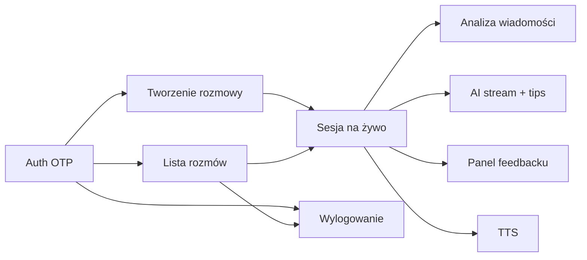

# Plan testów integracyjnych E2E (Playwright)

> Dokument opisuje pełne user flow do pokrycia testami integracyjnymi w projekcie **ord-frontend**.
> Testy odzwierciedlają ścieżki użytkownika end-to-end — nie izolowane komponenty.
>
> **Status:** plan zaakceptowany do realizacji sekwencyjnej po fazach.
> **Ostatnia aktualizacja:** 2026-06-30

---

## Spis treści

1. [Analiza krytyczności funkcji](#1-analiza-krytyczności-funkcji)
2. [Stan testów dziś](#2-stan-testów-dziś)
3. [Struktura katalogów](#3-struktura-katalogów)
4. [Harmonogram i kolejność realizacji](#4-harmonogram-i-kolejność-realizacji)
5. [Wymagania infrastrukturalne](#5-wymagania-infrastrukturalne)
6. [Zadania — Faza 0: Infrastruktura](#faza-0-infrastruktura)
7. [Zadania — Faza 1: Auth (P0)](#faza-1-auth-p0)
8. [Zadania — Faza 2: Lista rozmów (P0)](#faza-2-lista-rozmów-p0)
9. [Zadania — Faza 3: Tworzenie rozmowy (P0)](#faza-3-tworzenie-rozmowy-p0)
10. [Zadania — Faza 4: Sesja na żywo (P0)](#faza-4-sesja-na-żywo-p0)
11. [Zadania — Faza 5: Feedback (P1)](#faza-5-feedback-p1)
12. [Zadania — Faza 6: Filtry i AI topics (P1)](#faza-6-filtry-i-ai-topics-p1)
13. [Zadania — Faza 7: TTS (P1)](#faza-7-tts-p1)
14. [Zadania — Faza 8: Activity i chrome (P2)](#faza-8-activity-i-chrome-p2)

---

## 1. Analiza krytyczności funkcji

Ord to aplikacja do nauki języków przez rozmowy z AI z natychmiastowym feedbackiem.
Rdzeń produktu to pętla: **logowanie → lista rozmów → tworzenie → sesja na żywo → analiza i wskazówki**.

### P0 — Krytyczne (bez tego produkt nie działa)

| Obszar | Dlaczego krytyczne | Zależności |
|--------|-------------------|------------|
| **Autentykacja OTP** | Bramka do całej aplikacji; sesja cookie + cache w `localStorage` | Backend `/auth/otp-request`, `/auth/otp-verify`, `/users/me` |
| **Lista rozmów** | Główny hub po zalogowaniu; powrót z sesji | Auth, `/conversations/`, `/conversations/overview` |
| **Tworzenie rozmowy (4 kroki)** | Wejście w nową sesję | Auth, profil użytkownika (`selectedLearningLanguage`), SSE topic suggestions, AI interlocutor |
| **Sesja na żywo — podstawowy chat** | Rdzeń wartości produktu | SSE init + stream AI, save message |
| **Wylogowanie** | Bezpieczeństwo sesji | `/auth/logout`, czyszczenie storage |

### P1 — Ważne (silne różnicowanie produktu)

| Obszar | Dlaczego ważne |
|--------|----------------|
| **Analiza wiadomości użytkownika** | Główna wartość edukacyjna — highlighty, metryki |
| **Learning tips na wiadomościach AI** | Drugi filar feedbacku |
| **Panel feedbacku (summary / analysis / tips)** | Pełny obraz postępów, wykresy |
| **TTS (odtwarzanie AI)** | UX słuchania wymowy |
| **Filtrowanie listy rozmów** | Nawigacja przy wielu sesjach |
| **Wznawianie istniejącej rozmowy** | Retencja użytkownika |

### P2 — Wspierające / niekompletne

| Obszar | Status |
|--------|--------|
| Activity heatmap + statystyki | Ważne wizualnie, ale nie blokuje core loop |
| Theme switcher (light/dark) | UX, nie biznesowe |
| i18n (en/pl/de) | Częściowo — login i create są przetłumaczone, sesja ma hardcoded PL |
| Home `/` | Placeholder — po logowaniu użytkownik ląduje na pustej stronie |
| Words, Challenges, QAW, Settings | Wyłączone lub brak route |
| 3 typy rozmów (roleplay, exam, debate) | Disabled w UI |

### Mapa zależności (core loop)



---

## 2. Stan testów dziś

- Playwright jest w `devDependencies`, ale **tylko jako provider dla Vitest browser mode** — brak folderu `e2e/`, brak `@playwright/test`, brak skryptu `test:e2e`.
- 8 testów jednostkowych (utils, TTS API, grupowanie listy).
- **Brak testów integracyjnych** auth, create flow, sesji SSE.

---

## 3. Struktura katalogów

```
e2e/
├── playwright.config.ts
├── fixtures/
│   ├── auth.fixture.ts          # login helper, storageState
│   ├── conversation.fixture.ts  # tworzenie rozmowy przez UI
│   └── test-env.ts              # PUBLIC_API_URL, test user email
├── helpers/
│   ├── otp.ts                   # pobranie OTP z backendu testowego / mock
│   ├── selectors.ts             # aria-label, role-based selectors
│   └── wait-for-sse.ts          # czekanie na zakończenie streamu AI
└── flows/
    ├── 01-auth/
    │   ├── login-happy-path.spec.ts
    │   ├── login-validation-errors.spec.ts
    │   ├── session-persistence.spec.ts
    │   └── logout.spec.ts
    ├── 02-conversations-list/
    │   ├── list-and-navigation.spec.ts
    │   ├── filters.spec.ts
    │   └── activity-overview.spec.ts
    ├── 03-create-conversation/
    │   ├── create-full-flow.spec.ts
    │   ├── create-with-ai-topics.spec.ts
    │   └── create-validation-and-back.spec.ts
    ├── 04-live-session/
    │   ├── new-session-initialization.spec.ts
    │   ├── send-message-and-receive-ai-reply.spec.ts
    │   ├── resume-existing-conversation.spec.ts
    │   └── session-navigation-back.spec.ts
    ├── 05-feedback/
    │   ├── inline-analysis-highlights.spec.ts
    │   ├── learning-tips-on-ai-message.spec.ts
    │   ├── feedback-panel-summary.spec.ts
    │   └── feedback-panel-drilldown.spec.ts
    ├── 06-tts/
    │   └── play-ai-message-audio.spec.ts
    └── 07-app-chrome/
        ├── theme-persistence.spec.ts
        └── locale-switching.spec.ts
```

**Szacunkowa liczba scenariuszy:** ~20 testów integracyjnych w 7 grupach flow.

---

## 4. Harmonogram i kolejność realizacji

| Etap | Zakres | Pliki testów | Priorytet | Status |
|------|--------|--------------|-----------|--------|
| **0** | Infrastruktura Playwright | `playwright.config.ts`, fixtures, helpers, CI | — | ✅ Zrobione |
| **1** | Auth | `01-auth/*` (4 pliki) | P0 | ✅ Zrobione |
| **2** | Lista + nawigacja | `02-conversations-list/list-and-navigation` | P0 | ⬜ Do zrobienia |
| **3** | Tworzenie rozmowy | `03-create-conversation/create-full-flow` | P0 | ⬜ Do zrobienia |
| **4** | Sesja na żywo | `04-live-session/*` (4 pliki) | P0 | ⬜ Do zrobienia |
| **5** | Feedback | `05-feedback/*` (4 pliki) | P1 | ⬜ Do zrobienia |
| **6** | Filtry + AI topics | `02-filters`, `03-create-with-ai-topics` | P1 | ⬜ Do zrobienia |
| **7** | TTS | `06-tts/*` | P1 | ⬜ Do zrobienia |
| **8** | Activity + chrome | `activity-overview`, `07-app-chrome/*` | P2 | ⬜ Do zrobienia |

---

## 5. Wymagania infrastrukturalne

1. **Backend testowy** — dedykowane środowisko (`PUBLIC_API_URL`) z możliwością:
   - deterministycznego OTP (endpoint testowy lub stały kod dla test usera),
   - seed data (użytkownik z historią rozmów),
   - stabilnych odpowiedzi AI (mock SSE lub timeouty w testach).

2. **Selektory** — dziś brak `data-testid`; testy oparte na `aria-label`, role i tekst. Warto dodać kluczowe `data-testid` w:
   - textarea sesji, send button,
   - kroki multi-step form,
   - wiersze listy rozmów.

3. **Czekanie na SSE** — helper `wait-for-sse.ts` z timeoutem i detekcją zakończenia streamu.

4. **CI** — osobny job `test:e2e` z uruchomionym backendem (docker-compose lub staging).

---

## Faza 0: Infrastruktura

- [x] **E2E-000** Zainstalować `@playwright/test` i dodać skrypt `test:e2e` w `package.json`
- [x] **E2E-001** Utworzyć `e2e/playwright.config.ts` (baseURL, webServer, storageState, retries)
- [x] **E2E-002** Utworzyć `e2e/fixtures/test-env.ts` — zmienne środowiskowe testowe
- [x] **E2E-003** Utworzyć `e2e/fixtures/auth.fixture.ts` — helper logowania + `storageState`
- [x] **E2E-004** Utworzyć `e2e/helpers/otp.ts` — pobieranie/wstrzykiwanie kodu OTP
- [x] **E2E-005** Utworzyć `e2e/helpers/selectors.ts` — scentralizowane selektory UI
- [x] **E2E-006** Utworzyć `e2e/helpers/wait-for-sse.ts` — helper czekania na stream AI
- [x] **E2E-007** Dodać `.env.e2e.example` z wymaganymi zmiennymi
- [x] **E2E-008** Zaktualizować README o sekcję E2E

---

## Faza 1: Auth (P0)

### `01-auth/login-happy-path.spec.ts`

**Flow:** Niezalogowany użytkownik → pełne logowanie → dostęp do chronionej strefy

| Krok | Akcja użytkownika | Asercja |
|------|-------------------|---------|
| 1 | Wejście na `/conversations` | Redirect na `/login` |
| 2 | Wpisanie poprawnego emaila → submit | Przejście do kroku OTP |
| 3 | Wpisanie 6-cyfrowego kodu (auto-submit) | Redirect po zalogowaniu |
| 4 | Nawigacja do `/conversations` | Lista rozmów widoczna, brak redirectu |
| 5 | Sprawdzenie sidebara | Avatar/email użytkownika widoczny |

- [x] **E2E-101** Zaimplementować `login-happy-path.spec.ts`

### `01-auth/login-validation-errors.spec.ts`

**Flow:** Błędne dane → komunikaty błędów → poprawka → sukces

| Krok | Akcja | Asercja |
|------|-------|---------|
| 1 | Submit pustego / niepoprawnego emaila | Alert z błędem walidacji |
| 2 | Poprawny email → OTP | Przejście do OTP |
| 3 | Submit niepełnego kodu | Błąd walidacji OTP |
| 4 | Niepoprawny kod z API | Komunikat błędu z backendu |
| 5 | Poprawny kod | Logowanie udane |

- [x] **E2E-102** Zaimplementować `login-validation-errors.spec.ts`

### `01-auth/session-persistence.spec.ts`

**Flow:** Zalogowanie → odświeżenie strony → sesja zachowana

| Krok | Akcja | Asercja |
|------|-------|---------|
| 1 | Login przez fixture | Zalogowany |
| 2 | `page.reload()` na `/conversations` | Brak redirectu na login |
| 3 | Nowa karta z `storageState` | Sesja aktywna bez ponownego logowania |

- [x] **E2E-103** Zaimplementować `session-persistence.spec.ts`

### `01-auth/logout.spec.ts`

**Flow:** Zalogowany użytkownik → wylogowanie → utrata dostępu

| Krok | Akcja | Asercja |
|------|-------|---------|
| 1 | Klik „Logout" w sidebarze | Redirect na `/login` |
| 2 | Próba wejścia na `/conversations` | Redirect na `/login` |
| 3 | Sprawdzenie `localStorage` | Dane użytkownika wyczyszczone |

- [x] **E2E-104** Zaimplementować `logout.spec.ts`

---

## Faza 2: Lista rozmów (P0)

### `02-conversations-list/list-and-navigation.spec.ts`

**Flow:** Dashboard → przeglądanie → wejście w rozmowę / tworzenie nowej

| Krok | Akcja | Asercja |
|------|-------|---------|
| 1 | Wejście na `/conversations` (zalogowany) | Nagłówek, przycisk „New conversation" |
| 2 | Sprawdzenie listy | Rozmowy pogrupowane (Today, Yesterday, …) lub empty state |
| 3 | Klik wiersza rozmowy | Nawigacja do `/conversations/{id}` |
| 4 | Powrót breadcrumb/back | Powrót na listę |
| 5 | Klik „New conversation" | Nawigacja do `/conversations/create` |

- [ ] **E2E-201** Zaimplementować `list-and-navigation.spec.ts`

### `02-conversations-list/filters.spec.ts` *(Faza 6)*

| Krok | Akcja | Asercja |
|------|-------|---------|
| 1 | Wpisanie tekstu w search (debounce) | Lista przefiltrowana |
| 2 | Wybór recency bucket | Tylko pasujące rozmowy |
| 3 | Wybór typu rozmowy | Filtrowanie po typie |
| 4 | Clear filters | Pełna lista / empty state |

- [ ] **E2E-202** Zaimplementować `filters.spec.ts`

### `02-conversations-list/activity-overview.spec.ts` *(Faza 8)*

| Krok | Akcja | Asercja |
|------|-------|---------|
| 1 | Wejście na listę | Sekcja activity widoczna |
| 2 | Heatmapa | Komórki z `aria-label` |
| 3 | Stat cards | Liczby wiadomości/rozmów |
| 4 | (opcjonalnie) symulacja błędu API | Banner błędu + retry, lista nadal działa |

- [ ] **E2E-203** Zaimplementować `activity-overview.spec.ts`

---

## Faza 3: Tworzenie rozmowy (P0)

### `03-create-conversation/create-full-flow.spec.ts`

**Flow:** Pełny 4-krokowy builder → start sesji

| Krok | Akcja | Asercja |
|------|-------|---------|
| 1 | `/conversations/create` | Krok 1: wybór typu (np. Small talk) |
| 2 | Next (lub skrót klawiszowy) | Krok 2: wybór tonu |
| 3 | Next | Krok 3: wpisanie/wybór tematu |
| 4 | Next | Krok 4: podsumowanie + AI interlocutor (loading → gotowy) |
| 5 | „Start conversation" | Redirect na `/conversations/{id}` |
| 6 | Czekanie na init SSE | Pierwsza wiadomość AI widoczna w panelu |

- [ ] **E2E-301** Zaimplementować `create-full-flow.spec.ts`

### `03-create-conversation/create-with-ai-topics.spec.ts` *(Faza 6)*

| Krok | Akcja | Asercja |
|------|-------|---------|
| 1 | Krok 3: klik „generate topics" | SSE stream → lista tematów |
| 2 | Pin/unpin tematu | Stan pinezki zmieniony |
| 3 | Wybór tematu → dalej | Temat w podsumowaniu |

- [ ] **E2E-302** Zaimplementować `create-with-ai-topics.spec.ts`

### `03-create-conversation/create-validation-and-back.spec.ts`

| Krok | Akcja | Asercja |
|------|-------|---------|
| 1 | Próba Next bez wyboru typu/tonu/tematu | Walidacja blokuje przejście |
| 2 | Back między krokami | Poprzednie wybory zachowane |
| 3 | Anulowanie / powrót do listy | Nawigacja na `/conversations` |

- [ ] **E2E-303** Zaimplementować `create-validation-and-back.spec.ts`

---

## Faza 4: Sesja na żywo (P0)

### `04-live-session/new-session-initialization.spec.ts`

| Krok | Akcja | Asercja |
|------|-------|---------|
| 1 | Fixture: utworzona rozmowa | Sesja załadowana |
| 2 | Obserwacja panelu wiadomości | Streaming AI (lub finalna wiadomość) |
| 3 | Czekanie na zakończenie generacji | Brak spinnera „generating" |
| 4 | Sprawdzenie pod wiadomością AI | Sekcja learning tips (lub loading → content) |
| 5 | Header sesji | Temat, typ, ton widoczne |

- [ ] **E2E-401** Zaimplementować `new-session-initialization.spec.ts`

### `04-live-session/send-message-and-receive-ai-reply.spec.ts`

**Flow:** Pełna tura rozmowy — najważniejszy test integracyjny

| Krok | Akcja | Asercja |
|------|-------|---------|
| 1 | Sesja z wiadomością AI (fixture) | Textarea aktywna |
| 2 | Wpisanie wiadomości użytkownika → Enter | Wiadomość pojawia się w czacie |
| 3 | Czekanie na analizę (async) | Pod wiadomością użytkownika: sekcja analizy / highlighty |
| 4 | Czekanie na odpowiedź AI (SSE) | Nowa wiadomość AI w czacie |
| 5 | Czekanie na learning tips | Tips pod wiadomością AI |
| 6 | Liczba wiadomości | Min. 3 (AI init + user + AI reply) |

- [ ] **E2E-402** Zaimplementować `send-message-and-receive-ai-reply.spec.ts`

### `04-live-session/resume-existing-conversation.spec.ts`

| Krok | Akcja | Asercja |
|------|-------|---------|
| 1 | Lista → klik istniejącej rozmowy | Historia wiadomości załadowana |
| 2 | Brak ponownego init SSE | Istniejące wiadomości od razu widoczne |
| 3 | Wysłanie nowej wiadomości | Normalna tura (save + AI reply) |

- [ ] **E2E-403** Zaimplementować `resume-existing-conversation.spec.ts`

### `04-live-session/session-navigation-back.spec.ts`

| Krok | Akcja | Asercja |
|------|-------|---------|
| 1 | W trakcie sesji klik „back" / breadcrumb | `/conversations` |
| 2 | Ponowne wejście w tę samą rozmowę | Wszystkie wiadomości na miejscu |

- [ ] **E2E-404** Zaimplementować `session-navigation-back.spec.ts`

---

## Faza 5: Feedback (P1)

### `05-feedback/inline-analysis-highlights.spec.ts`

| Krok | Akcja | Asercja |
|------|-------|---------|
| 1 | Wysłanie wiadomości z celowym błędem gramatycznym | Wiadomość w czacie |
| 2 | Czekanie na analizę | Sekcja analizy pod wiadomością |
| 3 | Hover/klik na highlight | Popover z opisem błędu |
| 4 | Toggle highlight icons | Highlighty włącz/wyłącz |

- [ ] **E2E-501** Zaimplementować `inline-analysis-highlights.spec.ts`

### `05-feedback/learning-tips-on-ai-message.spec.ts`

| Krok | Akcja | Asercja |
|------|-------|---------|
| 1 | Po odpowiedzi AI | Sekcja learning tips widoczna |
| 2 | Expand tips | Pełna lista wskazówek |
| 3 | Highlighty w tekście AI | Gramatyka/słownictwo podświetlone |

- [ ] **E2E-502** Zaimplementować `learning-tips-on-ai-message.spec.ts`

### `05-feedback/feedback-panel-summary.spec.ts`

| Krok | Akcja | Asercja |
|------|-------|---------|
| 1 | Po kilku turach rozmowy | Otwarcie panelu feedbacku |
| 2 | Tab Overview | Wykresy performance, metryki |
| 3 | Tab Learning Tips | Zagregowane wskazówki |
| 4 | Tab Analysis | Lista analiz wiadomości |

- [ ] **E2E-503** Zaimplementować `feedback-panel-summary.spec.ts`

### `05-feedback/feedback-panel-drilldown.spec.ts`

| Krok | Akcja | Asercja |
|------|-------|---------|
| 1 | Klik analizy konkretnej wiadomości | Widok szczegółowy |
| 2 | Breadcrumb back | Powrót do summary |
| 3 | To samo dla learning tips | Drill-down + powrót |

- [ ] **E2E-504** Zaimplementować `feedback-panel-drilldown.spec.ts`

---

## Faza 6: Filtry i AI topics (P1)

- [ ] **E2E-202** Filtry listy rozmów — patrz Faza 2
- [ ] **E2E-302** Generowanie tematów AI w create flow — patrz Faza 3

---

## Faza 7: TTS (P1)

### `06-tts/play-ai-message-audio.spec.ts`

| Krok | Akcja | Asercja |
|------|-------|---------|
| 1 | Klik play na wiadomości AI | Przycisk zmienia się na stop |
| 2 | Progress bar | Postęp odtwarzania |
| 3 | Klik stop / play na innej wiadomości | Poprzednie zatrzymane |

- [ ] **E2E-601** Zaimplementować `play-ai-message-audio.spec.ts`

---

## Faza 8: Activity i chrome (P2)

### `07-app-chrome/theme-persistence.spec.ts`

| Krok | Akcja | Asercja |
|------|-------|---------|
| 1 | Toggle dark mode | Klasa `dark` na `<html>` |
| 2 | Reload | Motyw zachowany |

- [ ] **E2E-701** Zaimplementować `theme-persistence.spec.ts`

### `07-app-chrome/locale-switching.spec.ts`

| Krok | Akcja | Asercja |
|------|-------|---------|
| 1 | Zmiana języka na loginie | Teksty UI zmienione (pl/de/en) |
| 2 | Nawigacja po zmianie | Locale utrzymany |

- [ ] **E2E-702** Zaimplementować `locale-switching.spec.ts`

- [ ] **E2E-203** Activity overview — patrz Faza 2

---

## Podsumowanie pokrycia

| Priorytet | User flows | Liczba scenariuszy | ID zadań |
|-----------|------------|-------------------|----------|
| **P0** | Auth, lista, create, sesja (init + chat + resume + back) | ~10 | E2E-101–104, E2E-201, E2E-301, E2E-303, E2E-401–404 |
| **P1** | Feedback (inline + panel), filtry, AI topics, TTS | ~7 | E2E-202, E2E-302, E2E-501–504, E2E-601 |
| **P2** | Activity overview, theme, locale | ~3 | E2E-203, E2E-701–702 |
| **Infra** | Playwright setup | 9 zadań | E2E-000–008 |

**Łącznie:** ~29 zadań (9 infra + ~20 scenariuszy testowych)
