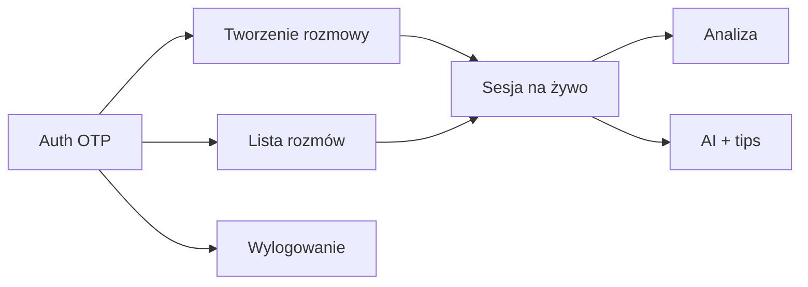

# Plan testów integracyjnych E2E (Playwright)

> Pełne user flow end-to-end dla **ord-frontend** — nie testy izolowanych komponentów.
>
> **Status:** Faza 0 + Faza 1 gotowe do merge; **Faza 2 (data-testid) zaimplementowana** — pending weryfikacja `bun run test:e2e` z backendem + E2E-010 CI.
> **Ostatnia aktualizacja:** 2026-07-01 (Faza 2: data-testid w aplikacji)

---

## Spis treści

1. [Podsumowanie stanu](#1-podsumowanie-stanu)
2. [Analiza krytyczności funkcji](#2-analiza-krytyczności-funkcji)
3. [Konwencje i wzorzec POM](#3-konwencje-i-wzorzec-pom)
4. [Lekcje z code review](#4-lekcje-z-code-review)
5. [Struktura katalogów](#5-struktura-katalogów)
6. [Harmonogram](#6-harmonogram)
7. [Wymagania infrastrukturalne](#7-wymagania-infrastrukturalne)
8. [Faza 0: Infrastruktura](#faza-0-infrastruktura)
9. [Faza 1: Auth — zaimplementowane](#faza-1-auth--zaimplementowane)
10. [Roadmap: Fazy 2–8](#roadmap-fazy-28)
11. [Znane ograniczenia i tech debt](#znane-ograniczenia-i-tech-debt)
12. [Podsumowanie pokrycia](#podsumowanie-pokrycia)

---

## 1. Podsumowanie stanu

| Obszar                                            | Status                              |
| ------------------------------------------------- | ----------------------------------- |
| Infrastruktura Playwright (`e2e/`, POM, fixtures) | ✅ Zrobione                         |
| Faza 1 — auth (4 specy)                           | ✅ Zaimplementowane                 |
| Faza 2 — `data-testid` w aplikacji                | ✅ Zaimplementowane                 |
| CI workflow (`bun run test:e2e`)                  | ⬜ E2E-010                          |
| Fazy 3–8                                          | ⬜ Roadmap (poniżej)                |
| Testy jednostkowe (Vitest)                        | ✅ 8 plików (utils, TTS API, lista) |

### Uruchomienie

```bash
cp .env.e2e.example .env.e2e   # repo root — E2E_TEST_EMAIL, E2E_OTP_CODE, E2E_API_URL
bun run test:e2e:install
bun run test:e2e
```

Bez `.env.e2e` testy auth **skipują się** (`isE2eAuthConfigured()`), nie failują.

---

## 2. Analiza krytyczności funkcji

Rdzeń produktu: **logowanie → lista rozmów → tworzenie → sesja na żywo → analiza i wskazówki**.

### P0 — Krytyczne

| Obszar                      | Zależności                                           |
| --------------------------- | ---------------------------------------------------- |
| Autentykacja OTP            | `/auth/otp-request`, `/auth/otp-verify`, `/users/me` |
| Lista rozmów                | Auth, `/conversations/`, `/conversations/overview`   |
| Tworzenie rozmowy (4 kroki) | Auth, SSE topics, AI interlocutor                    |
| Sesja na żywo — chat        | SSE init + stream, save message                      |
| Wylogowanie                 | `/auth/logout`, czyszczenie storage                  |

### P1 — Ważne

Analiza wiadomości, learning tips, panel feedbacku, TTS, filtry listy, wznawianie rozmowy.

### P2 — Wspierające

Activity heatmap, theme, i18n (częściowe), home `/` (placeholder).



---

## 3. Konwencje i wzorzec POM

Pliki `*.spec.ts` opisują **wyłącznie user flow** — bez selektorów DOM.

### Zasady

| Zasada                                   | Opis                                                                |
| ---------------------------------------- | ------------------------------------------------------------------- |
| Page Object = strona/widok               | `LoginPage`, `ConversationsListPage`                                |
| Component Object = fragment UI           | `SidebarComponent`                                                  |
| Selektory tylko w Page/Component Objects | Nigdy w `*.spec.ts`                                                 |
| Fixtures dla domyślnego kontekstu        | `pages.fixture`, `auth.fixture`                                     |
| Fabryki dla dodatkowych kontekstów       | `createConversationsListPage(page)` w `e2e/helpers/page-objects.ts` |
| Brak stubów na przyszłe fazy             | Page Object powstaje **w tej samej fazie** co spec                  |
| Helpers = logika spoza UI                | OTP, env, storage — nie selektory                                   |

### Hierarchia (stan aktualny)

```
LoginPage
ConversationsListPage
SidebarComponent

# Powstaną w swojej fazie:
# CreateConversationPage      → Faza 3
# ConversationSessionPage     → Faza 4
```

### Wzorce selektorów

| Element UI                      | Selektor                                                     | Uwaga                                                                            |
| ------------------------------- | ------------------------------------------------------------ | -------------------------------------------------------------------------------- |
| Wszystkie kluczowe elementy E2E | `getByTestId(E2E_TEST_IDS.…)`                                | Stałe w `src/lib/testing/e2e-test-ids.ts`, re-export w `e2e/helpers/test-ids.ts` |
| Sidebar expand                  | `E2E_TEST_IDS.sidebar.toggle` + sprawdzenie `title`          | Rozwijanie tylko gdy zwinięty                                                    |
| OTP input                       | `E2E_TEST_IDS.login.otpDigit(n)`                             | Po `fill()` wymagany `submitOtp()` — `oncomplete` nie odpala się programowo      |
| Wiersze listy / wiadomości      | `E2E_TEST_IDS.conversations.row(id)`, `session.aiMessage(i)` | Dynamiczne ID przez helpery                                                      |

### Skip guard — kiedy i gdzie

| Miejsce                          | Kiedy                                                                                 |
| -------------------------------- | ------------------------------------------------------------------------------------- |
| `test.beforeEach` na `describe`  | Gdy **jakikolwiek** test w grupie woła `loginWithOtp` bez `authenticatedPage` fixture |
| `auth.fixture` → `testInfo.skip` | Gdy test używa wyłącznie `authenticatedPage`                                          |
| Nie duplikować obu               | `describe`-level skip wystarczy dla całej grupy auth                                  |

### Konfiguracja Playwright

| Ustawienie           | Wartość                                     | Powód                                           |
| -------------------- | ------------------------------------------- | ----------------------------------------------- |
| `outputDir` / report | `e2e/test-results`, `e2e/playwright-report` | Absolutne ścieżki w config                      |
| `webServer`          | `bun run dev`                               | Spójność z resztą repo                          |
| `.env.e2e`           | Ładowany w `test-env.ts` (lazy getters)     | ESM import order — nie w `playwright.config.ts` |

| `workers` | `1` | Wszystkie testy dzielą jednego usera; backend trzyma **jedną aktywną sesję na usera** — równoległe loginy się unieważniają |

Każdy zalogowany scenariusz robi własny `loginWithOtp` (API bez rate limitu, brak pliku `e2e/.auth`). Testy jadą **serialnie** (`workers: 1`), bo współbieżne loginy tego samego usera unieważniają sobie nawzajem sesje (`/users/me` → 401 → odbicie na `/login`).

---

## 4. Lekcje z code review

Zebrane z 5 rund automatycznego CR na PR #16. **Obowiązują przy kolejnych fazach.**

### Bugi, które omijamy

1. **OTP submit** — `fillOtp()` + `submitOtp()`; programowe fill nie wywołuje `oncomplete`.
2. **Disabled button** — nie klikać; asercja `toBeDisabled()` na submit (smoke scope — bez synthetic submit).
3. **Hardcoded email na loginie** — test „pustego emaila” musi `fillEmail('')` po `goto()`.
4. **`.env.e2e` path** — plik w **repo root**, nie `e2e/.env.e2e`.
5. **ESM env loading** — `loadEnvE2e()` (`dotenv`) w `test-env.ts` przed odczytem; lazy getters na `testEnv`.
6. **Icon buttons** — `data-testid` + `aria-expanded` (sidebar), nie `title` / locale.
7. **Skip guard** — każdy describe z OTP musi skipować gdy brak env.
8. **Storage keys** — importuj `STORAGE_KEYS` z app utils, nie duplikuj stringów.
9. **Multi-context** — `createConversationsListPage(page)`, nie `new` w spec.
10. **`authenticatedPage` fixture** — świeże logowanie OTP na test; bez cache plikowego między specami.

### Antywzorce (nie powtarzać)

- Stub Page Objects / fixture / factory „na zapas"
- `BasePage` abstract class bez współdzielonej logiki
- `helpers/selectors.ts` obok Page Objects (selektory żyją w PO)
- Oznaczanie zadań ✅ gdy plik nie istnieje
- 500+ linii planu z pełnymi tabelami kroków dla niezaimplementowanych faz
- Współdzielony `storage.json` między testami „żeby oszczędzić OTP" (niepotrzebne — API bez limitu)
- Równoległe loginy tego samego usera (backend = jedna sesja na usera → wyścig na `/users/me`)

### Dobre decyzje (zachować)

- POM — specy bez selektorów
- `storageState` w teście persistence (in-memory z bieżącego logowania) + `getStoredUser` w restore
- Roadmap oddzielony od zaimplementowanego kodu

---

## 5. Struktura katalogów

```
e2e/
├── playwright.config.ts
├── pages/
│   ├── login.page.ts
│   ├── conversations-list.page.ts
│   ├── components/sidebar.component.ts
│   └── index.ts
├── fixtures/
│   ├── pages.fixture.ts
│   ├── auth.fixture.ts
│   └── test-env.ts              # loadEnvE2e() + lazy getters
├── helpers/
│   ├── load-env.ts              # dotenv → .env.e2e
│   ├── page-objects.ts          # fabryki dla dodatkowych kontekstów
│   ├── otp.ts                     # resolveOtpCode
│   └── storage.ts                 # getStoredUser (STORAGE_KEYS z app)
└── flows/
    └── 01-auth/                   # ✅
        ├── 00-login-happy-path.spec.ts
        ├── 01-login-validation-errors.spec.ts
        ├── 02-session-persistence.spec.ts
        └── 03-logout.spec.ts
```

---

## 6. Harmonogram

| Etap   | Zakres                    | ID                   | Status          |
| ------ | ------------------------- | -------------------- | --------------- |
| **0**  | Infrastruktura Playwright | E2E-000–009          | ✅              |
| **0b** | CI workflow               | E2E-010              | ⬜              |
| **1**  | Auth smoke                | E2E-101–104, 102     | ✅              |
| **2**  | `data-testid` w aplikacji | E2E-110              | ✅              |
| **2b** | CI workflow               | E2E-010              | ⬜              |
| **3**  | Lista + nawigacja         | E2E-201              | ⬜ **następna** |
| **4**  | Tworzenie rozmowy         | E2E-301, E2E-303     | ⬜              |
| **5**  | Sesja na żywo             | E2E-401–404, E2E-006 | ⬜              |
| **6**  | Feedback                  | E2E-501–504          | ⬜              |
| **7**  | Filtry + AI topics        | E2E-202, E2E-302     | ⬜              |
| **8**  | TTS                       | E2E-601              | ⬜              |
| **9**  | Activity + chrome         | E2E-203, E2E-701–702 | ⬜              |

---

## 7. Wymagania infrastrukturalne

1. **Backend testowy** — `PUBLIC_API_URL`, deterministyczny OTP (`E2E_OTP_CODE` lub `E2E_OTP_FETCH_URL`), seed data.
2. **`data-testid` w aplikacji** — ✅ Faza 2 (`src/lib/testing/e2e-test-ids.ts`). Shared components: `Button`, `Input`, `IconButton`, `AutoHeightTextarea`, `DropdownSelect`, `Tabs` — prop `dataTestId`.
3. **SSE waits** — metody w `ConversationSessionPage` (Faza 5, E2E-006).
4. **CI** — `.github/workflows/e2e.yml` uruchamiający `bun run test:e2e` z backendem (E2E-010).
5. **`.env.e2e`** — format `KEY=value`, bez cudzysłowów/exportu/expansion (patrz `.env.e2e.example`).

---

## Faza 0: Infrastruktura

- [x] **E2E-000** `@playwright/test` + skrypty `test:e2e*` w `package.json`
- [x] **E2E-001** `playwright.config.ts` (baseURL, webServer, artefakty w `e2e/`)
- [x] **E2E-002** `test-env.ts` — env + auto-load `.env.e2e` (lazy getters)
- [x] **E2E-003** `auth.fixture.ts` — `authenticatedPage`, skip gdy brak env
- [x] **E2E-004** `otp.ts` — `resolveOtpCode`
- [x] **E2E-005** Selektory w Page Objects (`e2e/pages/`)
- [ ] **E2E-006** `ConversationSessionPage` + SSE wait — **Faza 4**
- [x] **E2E-007** `.env.e2e.example`
- [x] **E2E-008** README — sekcja E2E
- [x] **E2E-009** POM (`pages/`, `pages.fixture.ts`, `page-objects.ts`)
- [ ] **E2E-010** GitHub Actions workflow

---

## Faza 1: Auth — zaimplementowane

### Zachowanie aplikacji (ważne dla testów)

| Obszar             | Rzeczywiste zachowanie                                          |
| ------------------ | --------------------------------------------------------------- |
| Po OTP verify      | Redirect na `/` (placeholder home), nie `/conversations`        |
| Walidacja email    | Przycisk disabled gdy brak `@` lub pusty email — **bez alertu** |
| Login page default | Pusty email — testy walidacji same czyszczą pole                |
| Sidebar email      | Widoczny tylko gdy sidebar expanded (`ensureExpanded()`)        |

### Smoke scope (auth)

Każdy test z auth sam się loguje (`loginWithOtp` lub fixture `authenticatedPage`). **Kolejność plików nie ma znaczenia**, ale run jest serialny (`workers: 1`) — brak `e2e/.auth/`.

| Plik                                 | Scenariusze                              |
| ------------------------------------ | ---------------------------------------- |
| `00-login-happy-path.spec.ts`        | Redirect → login → lista → sidebar email |
| `01-login-validation-errors.spec.ts` | Disabled submit przy złym/pustym email   |
| `02-session-persistence.spec.ts`     | Reload + nowy kontekst ze `storageState` |
| `03-logout.spec.ts`                  | Wylogowanie + brak dostępu               |

**7 testów** — szybki smoke, nie pełne pokrycie edge case OTP.

### Scenariusze

| Plik                                 | Flow                                             | ID      | Kroki kluczowe                          |
| ------------------------------------ | ------------------------------------------------ | ------- | --------------------------------------- |
| `00-login-happy-path.spec.ts`        | Redirect → login → conversations → sidebar email | E2E-101 | `loginWithOtp`                          |
| `01-login-validation-errors.spec.ts` | Walidacja email (disabled button)                | E2E-102 | `toBeDisabled()` na submit              |
| `02-session-persistence.spec.ts`     | Reload + storageState w nowym kontekście         | E2E-103 | login → `storageState()` → nowy context |
| `03-logout.spec.ts`                  | Logout → brak dostępu                            | E2E-104 | `getStoredUser`                         |

- [x] **E2E-101** `00-login-happy-path.spec.ts`
- [x] **E2E-102** `01-login-validation-errors.spec.ts`
- [x] **E2E-103** `02-session-persistence.spec.ts`
- [x] **E2E-104** `03-logout.spec.ts`

---

## Faza 2: data-testid w aplikacji — zaimplementowane

Centralne stałe: `src/lib/testing/e2e-test-ids.ts` (re-export: `e2e/helpers/test-ids.ts`).

### Zakres

| Obszar  | Kluczowe testid                                                                                              | Pliki                                         |
| ------- | ------------------------------------------------------------------------------------------------------------ | --------------------------------------------- |
| Auth    | `login-page`, `login-email-input`, `login-otp-digit-N`, `login-error`                                        | `login/+page.svelte`, `otp-input.svelte`      |
| Sidebar | `sidebar-toggle`, `sidebar-user-email`, `sidebar-logout`                                                     | `sidebar.svelte`                              |
| Lista   | `conversations-heading`, `conversations-list`, `conversation-row-{id}`, filtry                               | `conversations/+page.svelte`, list components |
| Create  | `create-conversation-stepper`, `conversation-type-card-{type}`, `topic-row-{i}`, `create-conversation-start` | multi-step-form, create steps                 |
| Sesja   | `session-message-input`, `session-send-button`, `ai-message-{i}`, `feedback-panel`                           | session components                            |

### Shared components z `dataTestId` prop

`Button`, `Input`, `IconButton`, `AutoHeightTextarea`, `DropdownSelect`, `Tabs`, `MultiStepForm` (`dataTestIdPrefix`).

### Page Objects zaktualizowane

`LoginPage`, `ConversationsListPage`, `SidebarComponent` — wszystkie selektory przez `getByTestId(E2E_TEST_IDS.…)`.

- [x] **E2E-110** `data-testid` w aplikacji + aktualizacja POM auth/lista/sidebar

---

## Roadmap: Fazy 3–9

> Poniżej **backlog** — bez tabel kroków. Szczegóły user flow ustalamy przy implementacji danej fazy.
> Każda faza = nowy Page Object + spec(y) w tej samej PR.

| Faza  | Priorytet | Zadania              | User flow (skrót)                               | Nowe Page Objects                  |
| ----- | --------- | -------------------- | ----------------------------------------------- | ---------------------------------- |
| **3** | P0        | E2E-201              | Lista → klik rozmowy → New conversation         | Rozszerzyć `ConversationsListPage` |
| **4** | P0        | E2E-301, E2E-303     | 4-krokowy builder → start sesji; walidacja/back | `CreateConversationPage`           |
| **5** | P0        | E2E-401–404, E2E-006 | Init SSE → chat → resume → back                 | `ConversationSessionPage`          |
| **6** | P1        | E2E-501–504          | Inline highlights, panel feedbacku              | `FeedbackPanelComponent`           |
| **7** | P1        | E2E-202, E2E-302     | Filtry listy; AI topic suggestions              | Rozszerzenia PO z Faz 3–4          |
| **8** | P1        | E2E-601              | TTS play/stop na wiadomości AI                  | Metody w `ConversationSessionPage` |
| **9** | P2        | E2E-203, E2E-701–702 | Activity heatmap; theme; locale switching       | `PublicLayoutComponent`            |

### Kolejność realizacji

```
E2E-010 (CI) ──┐
               ├──► Faza 3 (E2E-201) ──► Faza 4 (E2E-301) ──► Faza 5 (E2E-401–404)
Faza 1–2 merge ┘         │                      │                    │
                         └── Faza 7 (E2E-202) ──┘                    │
                         └── Faza 7 (E2E-302) ─────────────────────┘
                                              Faza 6 (E2E-501–504)
                                              Faza 8 (E2E-601)
                                              Faza 9 (E2E-203, 701–702)
```

---

## Znane ograniczenia i tech debt

Akceptowalne na Fazę 1; adresować przy implementacji kolejnych faz.

| Ograniczenie                                            | Wpływ                                              | Planowana poprawa                  |
| ------------------------------------------------------- | -------------------------------------------------- | ---------------------------------- |
| `waitForLoginSuccess()` czeka na `/` (placeholder home) | Zmiana gdy produkt zdefiniuje inny post-auth route | Zaostrzyć w `LoginPage` (E2E-101+) |
| Brak CI (E2E-010)                                       | Brak automatycznej weryfikacji                     | Następny krok infra                |

---

## Podsumowanie pokrycia

| Priorytet | Scenariusze                   | Zadania                    | Status |
| --------- | ----------------------------- | -------------------------- | ------ |
| **Infra** | Setup Playwright              | E2E-000–009                | ✅     |
| **Infra** | CI                            | E2E-010                    | ⬜     |
| **P0**    | Auth                          | E2E-101–104                | ✅     |
| **P0**    | data-testid                   | E2E-110                    | ✅     |
| **P0**    | Lista, create, sesja          | E2E-201, 301, 303, 401–404 | ⬜     |
| **P1**    | Feedback, filtry, topics, TTS | E2E-202, 302, 501–504, 601 | ⬜     |
| **P2**    | Activity, theme, locale       | E2E-203, 701–702           | ⬜     |

**Łącznie:** ~31 zadań — **15 zrobionych**, **16 w roadmap**.
